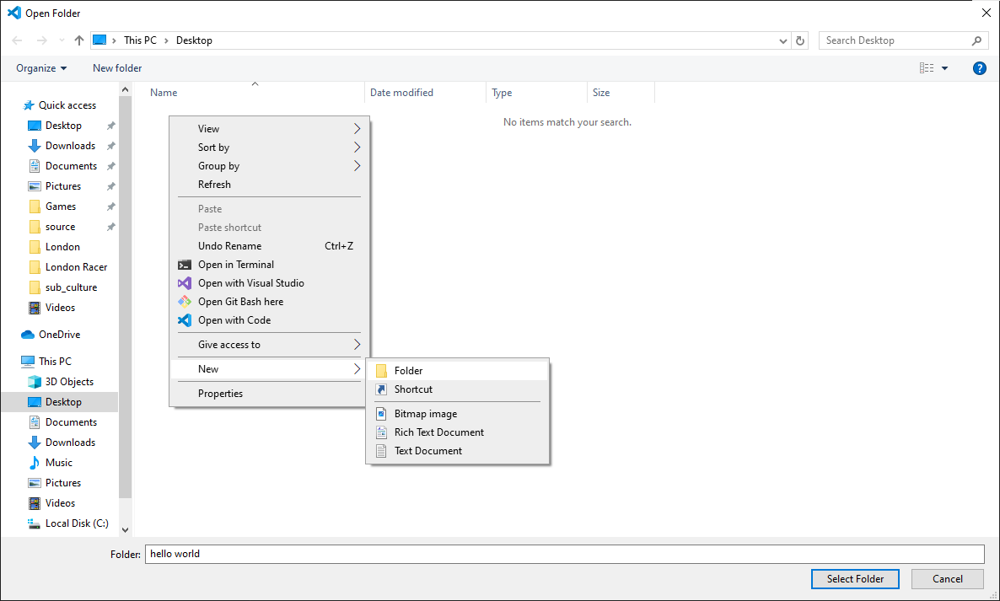
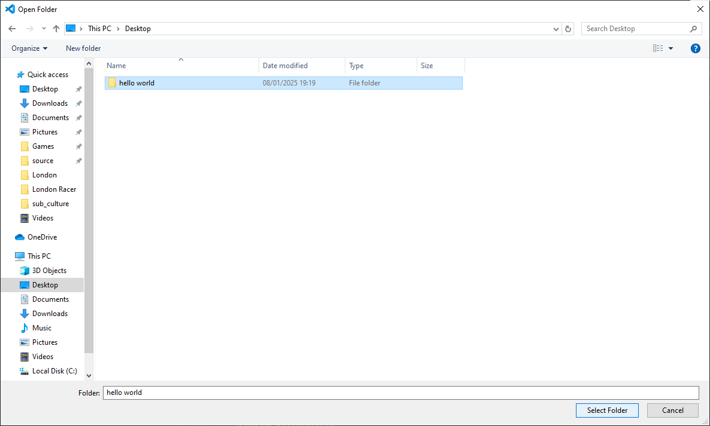
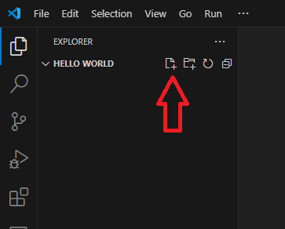
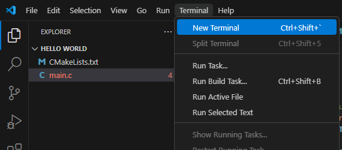
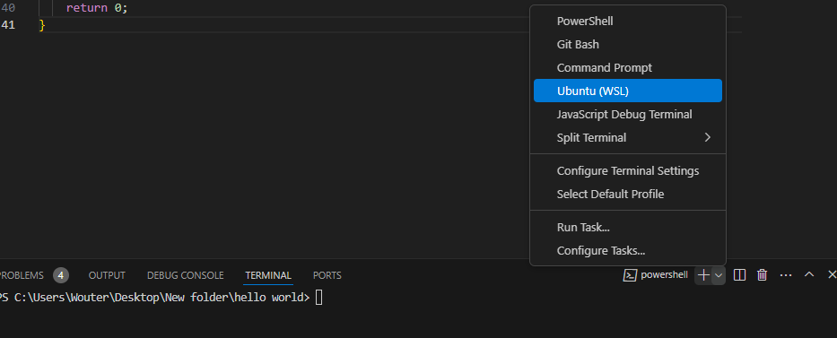

# How to use
{: .fs-8 .fw-700 .text-center }

This page will describe how to use the PSPDEV toolchain to build a basic program for the Playstation Portable (PSP), including screenshots. The screenshots will mainly be for Windows users, but the steps will not be much different for other operating systems, so you should be able to follow along.

Before going through this guide, make sure to have followed the [installation instructions](installation.html) first.

# Install a code editor
{: .fs-6 .fw-700 }

For developing programs for the PSP it is recommended to use [Visual Studio Code](https://code.visualstudio.com/). You can download the installer for it on the official website [here](https://code.visualstudio.com/Download). Please install it before continuing this guide.

While using Visual Studio Code, you may be asked to install useful plugins, which is a good idea to do.

# Creating a project
{: .fs-6 .fw-700 }

When you open Visual Studio Code, you'll be greeted by the welcome screen. Simply click the `Open Folder...` link on it or select this option from the `File` menu to get started:


Create a new folder and give it the name of your new project. As an example, lets take `hello world`:



Then click on the folder and click on the `Select Folder` button:



Now you've successfully created a new project.

# Writing a simple program
{: .fs-6 .fw-700 }

To start, clicking the `New File` button in Visual Studio Code, type the name `main.c` and press enter:



Lets add some very basic code to the file:

```c

```

This code will print "Hello World!" to the screen each frame. This may seem complex at first, but the `exit_callback`, `callback_thread` and `setup_callbacks` are just there to make the home button work and can be reused for any project. They only have to be run once. The `PSP_MODULE_INFO` is required and just contains the name of the software. `PSP_MAIN_THREAD_ATTR` will be set like this for every program. Only the content of the `main` function really matters here.

Now add an aditional file called `CMakeLists.txt`. Make sure the case matches, `cmakelists.txt` is not valid.

Add the following lines to `CMakeLists.txt`:

```cmake

```

The `CMakeLists.txt` file is used for CMake, which allows you to build the code. It contains which files to add to the program in the `add_executable` function and which libraries to link to using the `target_link_libraries` function. In this case we just link to the libraries required to write text to the screen. The `create_pbp_file` function is used to create an `EBOOT.PBP` file, so we can run on the program on the PSP.

# Building the code
{: .fs-6 .fw-700 }

For building, a terminal is used with a couple of short commands. To open a terminal in Visual Studio Code, select `Terminal` in the top bar and select `New Terminal`:



This will open a terminal at the bottom of the screen. On Windows, this will be a powershell window, but the PSPDEV toolchain is installed in WSL. To open a WSL terminal instead, click on the arrow next to the `+` sign at the right side an select `Ubuntu (WSL)`:



Now the code can be build with the following set of simple commands:

```shell
mkdir build
cd build
psp-cmake ..
make
```

The first line will create the `build` folder. The `cd` command moves you into the `build` folder. The `psp-cmake` command will create `Makefile` for the `make` command to be able to build the program, which happens in the last line.

After running these commands, you can go to the build folder in your project to find the `EBOOT.PBP` file. This file can be copied to a new folder in the `GAME` folder of your PSP memory stick. Then you'll be able to launch it. It should look like this:


If you make changes and you want to build the program with the new code, you'll only have to run `make` again. Do make sure you are in the build directory, though. If you are not, you can switch to it with `cd build`.

# Writing your own code
{: .fs-6 .fw-700 }

Now you know how to create code files and build them for the PSP, you will be able to create your own. For more examples of what kind of code you can write, take a look at the [Basic Programs page](basic_programs.html).
