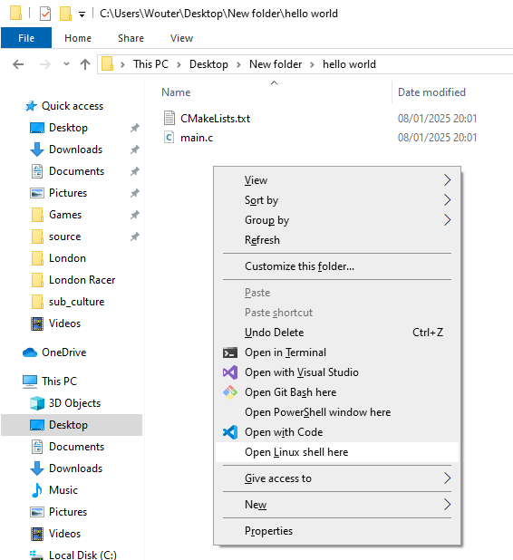

# Installation on Windows
{: .fs-8 .fw-700 .text-center }

## Windows Subsystem for Linux (WSL)
{: .fs-6 .fw-700 }

On Windows the PSP SDK is run on Ubuntu running on Microsoft's WSL. This is very easy to set up and will offer us the full power of Linux from a Windows machine.

To set up WSL with Ubuntu in it run the following commands in a Powershell window started as administrator (right click run as administrator on Powershell in the start menu):

```powershell
wsl --install
```

When this is done, restart your computer. Afterwards Ubuntu can be selected from the start menu to open a terminal, do this once to set up your user.

From now on the Ubuntu shell will be used when running commands going forward.

**Note:** You can open an Ubuntu terminal in a specific folder by holding shift and clicking the right mouse button on the background in the file explorer and selecting `Open Linux shell here`: 



This can be useful when building a specific project.

## Dependencies
{: .fs-6 .fw-700 }

The PSP SDK requires a couple of dependencies to be installed before use. To install them, run the following command from an Ubuntu terminal:

```shell
sudo apt-get update
```

```shell
sudo apt-get install build-essential cmake pkgconf libreadline8 libusb-0.1 libgpgme11 libarchive-tools fakeroot wget
```

## Toolchain 
{: .fs-6 .fw-700 }

Installing the PSP SDK itself can be done with the following steps:

1. In a fresh WSL Session download the Toolchain Archive using the following command:
    ```shell
    wget https://github.com/pspdev/pspdev/releases/latest/download/pspdev-ubuntu-latest-x86_64.tar.gz
    ```
2. Extract the archive using:
    ```shell
    tar -xvf pspdev-ubuntu-latest-x86_64.tar.gz
    ```
3. To make the toolchain usable, some environment variables need to be set. The first step in doing so it to open the `~/.bashrc` file with the `nano` text editor using the following command from an Ubuntu terminal:
    ```shell
    nano ~/.bashrc
    ```
4. Add the following lines at the bottom of the file in the text editor:
    ```shell
    export PSPDEV="$HOME/pspdev"
    export PATH="$PATH:$PSPDEV/bin"
    ```
5. Now save and exit by pressing `Ctrl`+`X`, then `Y` and then enter/return.
6. Close the current Ubuntu terminal and open a new one.
7. From the new Ubuntu terminal, run the following command to confirm everything is set up correctly:
    ```shell
    psp-config --pspdev-path
    ```
    If everything is set up correctly, the path of the PSP SDK installation will be shown.

That's it, now the PSP SDK can be used to build PSP software. Check out the [How to Use](../how_to_use.html) page for a guide on how to do so.
